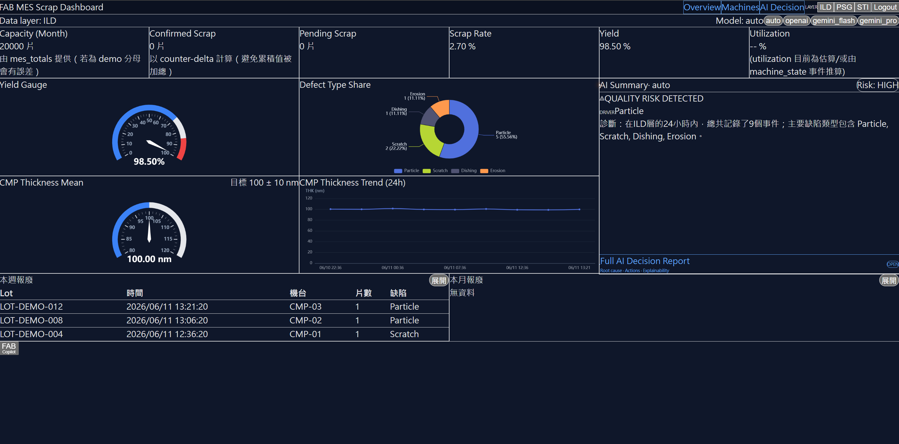
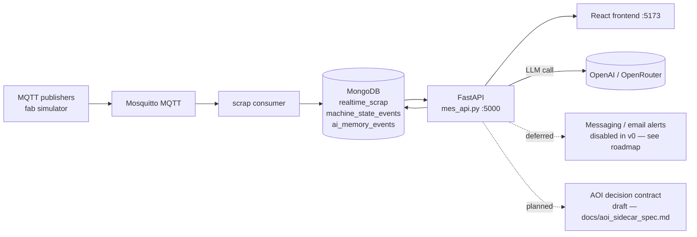

# FAB Copilot — Manufacturing AI Decision Support

> A semiconductor-fab dashboard that grew into a memory-aware AI copilot for engineering decisions. Realtime MES data → structured anomaly analysis → workflow continuity → decision support.

[](https://github.com/b10116006-art/fab-copilot-ai-mes-demo/actions/workflows/build.yml)

**Status:** buildable **public v0 candidate**. This is the no-auth, dashboard-only public snapshot. The React frontend builds clean; the FastAPI backend is included and designed to run against MongoDB + MQTT, but is **not yet verified end-to-end** in this snapshot. See the Public release roadmap below.



Synthetic demo data is generated by tools/demo_seed and does not contain real fab data.

---

## Public snapshot (v0)

This repository is the **no-auth, dashboard-only public snapshot** of the FAB Copilot project, intended as a buildable public demo.

- **Frontend build is green** — `npm ci` and `npm run build` both succeed (Vite production build).
- Deferred integrations such as login/auth, messaging alerts, email alert routing, OAuth login, and API authorization are intentionally disabled in this public v0 snapshot. They are not abandoned and will be reintroduced later through public-safe, env-only, feature-flagged PR phases.

---

## What it does

Manufacturing execution systems generate thousands of machine-state and scrap events per shift. Operators see them in dashboards but rarely get a *decision* out of the data. FAB Copilot adds an AI layer on top of a realtime MES pipeline:

- **MQTT → MongoDB** — machine-state and scrap events ingested by lightweight Python consumers.
- **FastAPI backend** — KPI aggregation, defect share, thickness trend, machine utilization, AI summary, and AI action endpoints.
- **React frontend (Vite)** — Overview (KPI + charts + AI summary card), Machines (state matrix + utilization), Machine Detail, AI Decision (deep-dive), and Copilot views.
- **LLM decision layer** — structured-output anomaly analysis with strict JSON guards, fed by ranked historical memory, returning typed JSON the frontend can render directly.
- **Memory layer (MVP)** — AI summaries persist to an `ai_memory_events` sidecar collection and are surfaced as ranked context on subsequent calls, enabling case continuity across sessions.

## Architecture



## Technology stack

| Layer | Choice |
|---|---|
| Messaging | Mosquitto (MQTT 3.1.1) |
| Storage | MongoDB (Atlas-style; compound + TTL index strategy) |
| Backend | FastAPI, pymongo, paho-mqtt |
| Frontend | React (Vite), Recharts, ECharts |
| LLM provider | OpenAI or OpenRouter, runtime-selectable (env-based) |
| Runtime | Python 3.11, Node 18+ |

## Backend capabilities (code included in this snapshot)

The FastAPI app (`modules/mes_api.py`) exposes MES read + AI endpoints, including:

- `/health`
- `/overview/kpi`, `/overview/defect/share`, `/overview/trend/thk`, `/overview/scrap/week`, `/overview/scrap/month`
- `/overview/ai`, `/overview/ai/action`
- `/machines/state`, `/machines/utilization`, `/machine/{machine_id}`
- `/mes/latest_status`, `/mes/top5_defects`, `/mes/thickness_trend`
- `/chatbot`

Supporting capabilities in the code:

- Structured LLM-output parsing with fallback guards (anomaly-type valid-set, confidence clamped to `[0,1]`, JSON-prefix tolerance, list/string coercion, summary fallback).
- **Memory layer (MVP)**: `ai_memory_events` sidecar collection, ranked retrieval by (layer, machine, recency), prompt injection into `/overview/ai` and `/overview/ai/action`.
- Workflow continuity: case identity and progression (`stable` / `improving` / `worsening`), guarded auto-closeout to `resolved`.
- Action trigger layer with an explicit safety gate: `blocked` / `preview_eligible` / `advisory`.
- Performance: in-memory KPI cache (TTL 30s), compound-index strategy on hot collections, `[perf]` instrumentation.

> The backend code is included as the system design. Only the frontend build is verified in this snapshot; running the backend requires a MongoDB instance and an MQTT broker. Treat backend run-status as **not yet verified end-to-end** here.

## What is explicitly NOT enabled in v0

This snapshot keeps a strict line between *included capability* and *verified / enabled feature*, to avoid overclaim:

- **Memory layer is MVP, not production-hardened.** Ranking quality, retrieval recall, schema migration, and TTL/index tuning are future work.
- **AOI integration is a draft contract only.** `docs/aoi_sidecar_spec.md` defines a proposed `/aoi/decision` contract; the optional AOI router is **not included** in this snapshot, and there is **no image inference / model / upstream image pipeline**. The contract exists so an inference service can be built against a stable shape.
- **RAG is not integrated.** Retrieval-grounded prompts are a separate, future track.
- **Messaging / email alerts are disabled.** Outbound push exists in the code but is gated off by default (env flag); inbound webhook handling is a reference implementation only and is not wired into the runtime.
- **No auth.** Login/auth, OAuth, and API authorization are intentionally excluded — see *Deferred, not abandoned*.

## Project structure

```
modules/
  mes_api.py                  FastAPI app — MES read + AI endpoints
  scrap_realtime_consumer.py  MQTT → MongoDB (scrap events)
app_v2_secure.py              Reference signature-verified webhook (not wired into runtime)
alert_monitor.py              Alert monitor (reference; disabled in v0)
db_init.py                    MongoDB index/bootstrap helper
docker-compose.yml            Container orchestration
Dockerfile                    Backend image
requirements.txt              Python dependencies
frontend/                     React (Vite) dashboard
docs/aoi_sidecar_spec.md      AOI decision contract (Draft / Planned)
```

## Quick start

**Frontend (verified):**

```bash
cd frontend
npm ci
npm run build      # production build → dist/
npm run dev        # local dev server on http://localhost:5173
```

Configure the backend base URL in `frontend/.env` (copy from `frontend/.env.example`; defaults to `http://127.0.0.1:5000`):

```
VITE_API_BASE_URL=http://127.0.0.1:5000
```

**Backend (requires your own MongoDB + MQTT; not verified in this snapshot):**

- Install dependencies: `pip install -r requirements.txt`
- Provide environment values for MongoDB and MQTT (and an OpenAI/OpenRouter key for LLM features). No secrets are committed.
- Serve the FastAPI app (`modules/mes_api.py`, ASGI object `app`) with uvicorn on port 5000:
  ```bash
  uvicorn modules.mes_api:app --host 0.0.0.0 --port 5000
  ```
- A container path is also provided via `docker-compose.yml` / `Dockerfile`.

## Engineering approach

- **Minimal-diff, additive design.** New features are added as additive sidecars/routers before existing handlers are touched, keeping changes easy to review and validate.
- **Strict overclaim discipline.** This README separates *included code* from *verified behavior*, and *implemented* from *deferred*.
- **Secrets stay in the environment.** No credentials in code; configuration is via environment variables and (in later phases) `.env.example` placeholders.

## Deferred, not abandoned

Several integrations are **intentionally disabled in this public v0 snapshot**, for **security, branding, and scope control**. They are **not abandoned**:

- **Login / auth**
- **API authorization**
- **Messaging alerts**
- **Email alert routing**
- **OAuth login**

They will be reintroduced later through dedicated, public-safe PR phases, using:

- **environment-only secrets** (no secrets in code or git history)
- **`.env.example` placeholders** (no real tokens)
- **no third-party trademark assets**
- **feature flags / preview mode — disabled by default**

## Public release roadmap

- **Public v0** — no-auth, dashboard-only; buildable public demo; no messaging / email / OAuth / API-authorization runtime enabled.
- **Public v1** — documentation + alert / API contract preview explanation.
- **Public v2** — messaging / email adapter **preview mode**, env-only config, no real tokens.
- **Public v3** — login / auth demo mode.
- **Public v4** — API authorization (token-based auth).
- **Public v5** — OAuth provider abstraction.

## License

MIT — see the `LICENSE` file.
